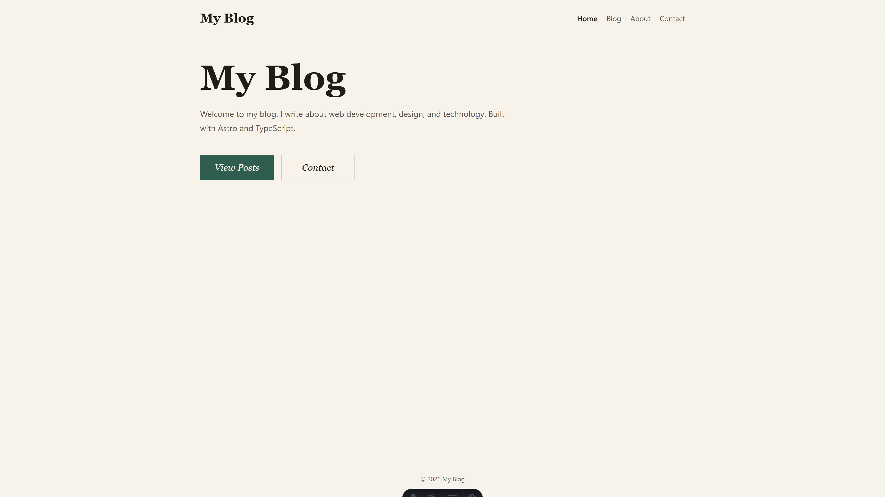

# Astro Blog Template

A modern, fast blog template built with Astro.



## Overview

- Static site built with Astro, focused on fast, accessible, and SEO-friendly delivery.
- Content is authored in Markdown/MDX and served as static pages with client-side enhancements.

## Tech Stack

- [Astro](https://astro.build/) (framework)
- TypeScript
- Markdown / MDX for content
- PWA (offline support)
- Zod config validation
- ESLint

## Project layout

```
/
├── public/           # Static assets (images, etc.)
├── src/
│   ├── blog/         # Markdown blog posts
│   ├── components/   # Reusable UI components
│   ├── config/       # JSON-LD schemas + site config
│   ├── images/       # Project images
│   ├── layouts/      # Layout components
│   ├── pages/        # Site pages and routes
|   ├── styles/       # Global theme styles
|   └── util/         # Utility helpers
└── package.json      # Project scripts and dependencies
```

## Getting started

1. Install dependencies

```sh
yarn install
```

2. Start the development server

```sh
yarn dev
```

3. Build for production

```sh
yarn build
```

4. Preview the production build locally

```sh
yarn preview
```

5. Run the baseline quality checks

```sh
yarn check
yarn lint
```

## Environment

Copy [.env.example](.env.example) to `.env` and set:

```sh
PUBLIC_SITE_URL=https://your-site.example
```

This value drives the validated site config in [src/config/site.ts](src/config/site.ts) and is used for Astro's site URL, canonical links, RSS, sitemap generation, and structured data.

## Notes / Conventions

- **Content**: Add new posts under `src/blog/`. Posts are MD or MDX and should follow the collection schema in `src/content.config.ts`.
- **Site config**: Update your name, URL, email, and social links in `src/config/site.ts`.
- **SEO**: JSON-LD schemas are auto-generated from `src/config/schema.ts`. Open Graph tags are in layouts.
- **RSS and Sitemap**: Generated automatically. Last-modified dates are derived from Git history.
- **PWA**: Service worker and assets are configured via the Vite PWA integration and `pwa-assets.config.ts`.
- **Validation**: Site config is parsed with Zod at build time so invalid URLs or missing metadata fail early.
- **Formatting**: Run Prettier with:

```sh
yarn prettier
```

- **Linting**: Run ESLint with:

```sh
yarn lint
```

## Customization

1. Edit `src/config/site.ts` with your personal information.
2. Set `PUBLIC_SITE_URL` in `.env` for your production domain.
3. Replace the logo SVGs in `public/` with your own.
4. Add your blog posts to `src/blog/` with images in `src/images/`.
5. Customize colors, typography, and shared layout styles in `src/styles/global.css`.

## Features

- Accessible, keyboard-friendly navigation
- SEO best practices
- Responsive design
- Markdown-powered blog
